# Assigment-6
In this assignment, an application has been developed that displays the users and the pictures shared by them on the Map. The user signs up to the application with their email, password and username. On the home screen, the user selects a picture from the gallery or camera and shares it by previewing the picture. During sharing, the current location of the user is saved with the picture. On the map screen, all users sharing pictures are shown on the map with their locations. If desired, the shared pictures can be viewed by pressing on them.

## Used technologies
- Expo CLI
- React Native Navigation
- Redux Toolkit
- Firebase Authentication
- Firebase Firestore
- Firebase Storage
- Expo Image Picker
- Expo Location
- React Native Maps
- React Hook Form
- React Native Vector Icons
- React Native AsyncStorage

## Screens
<div>
<kbd>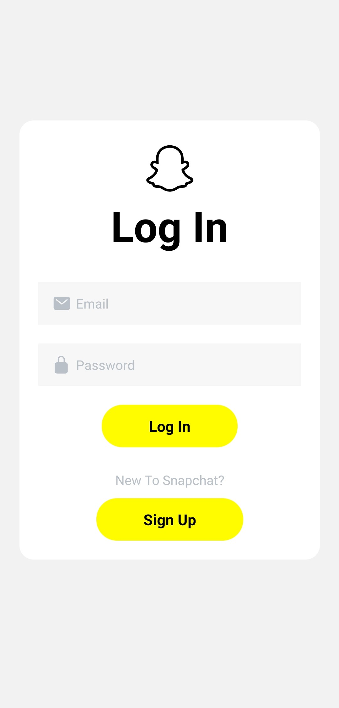</kbd>
<kbd>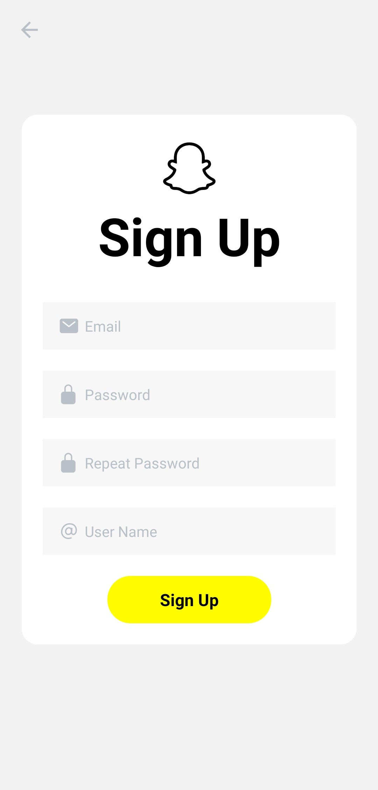</kbd>
<kbd>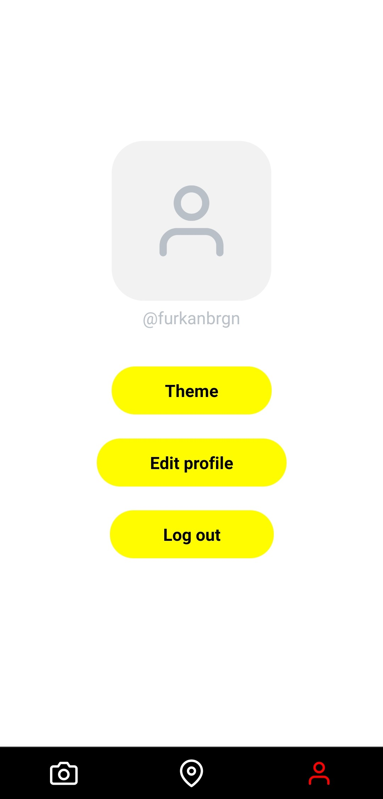</kbd>
</div>
<div>
<kbd>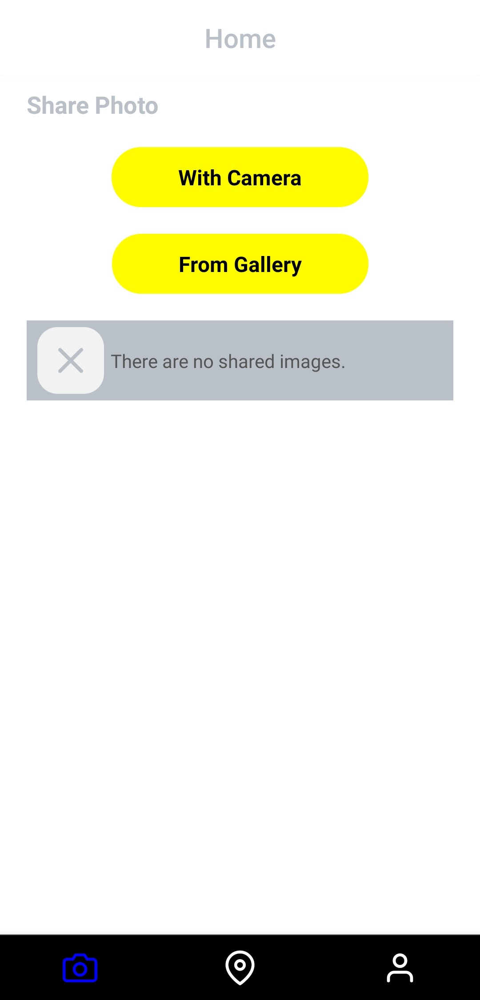</kbd>
<kbd>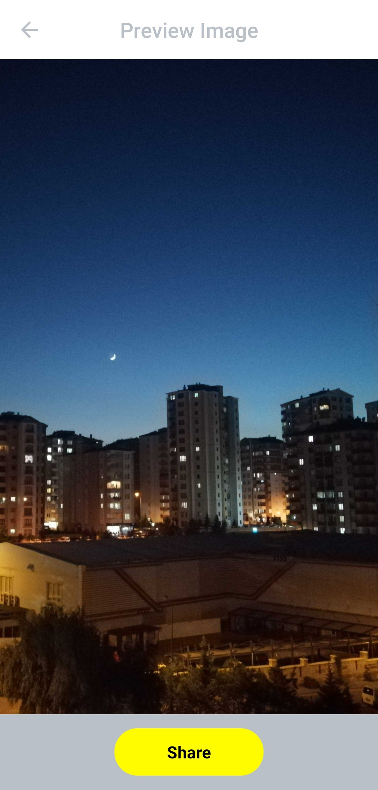</kbd>
<kbd></kbd>
</div>
<div>
<kbd></kbd>
<kbd>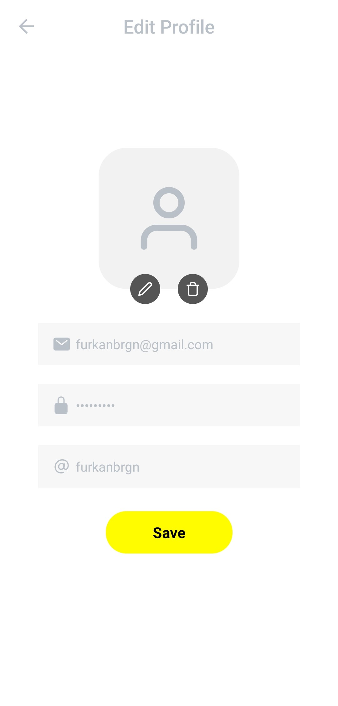</kbd>
<kbd>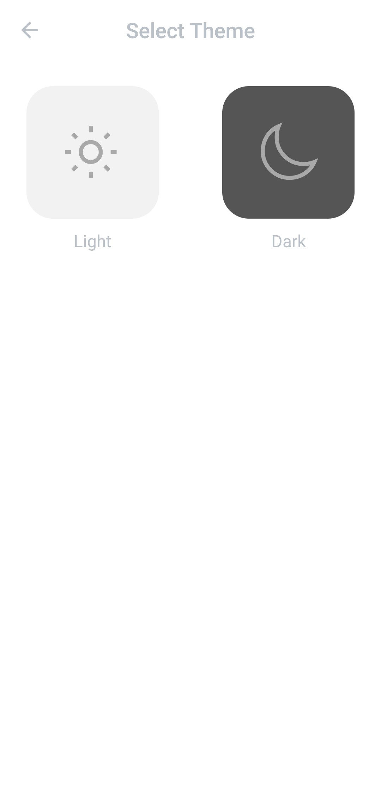</kbd>
</div>
<div>
<kbd>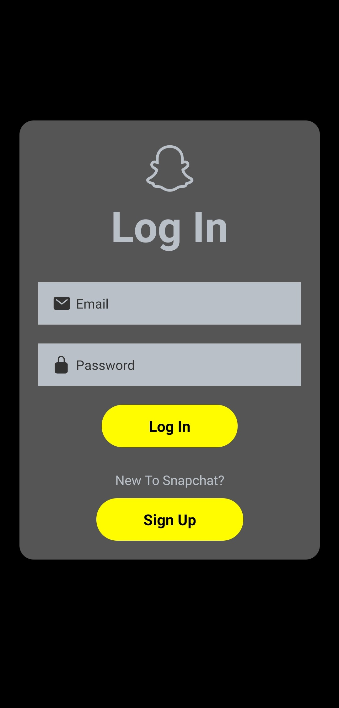</kbd>
<kbd></kbd>
<kbd>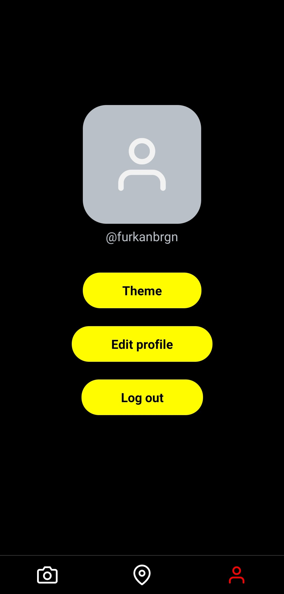</kbd>
</div>
<div>
<kbd>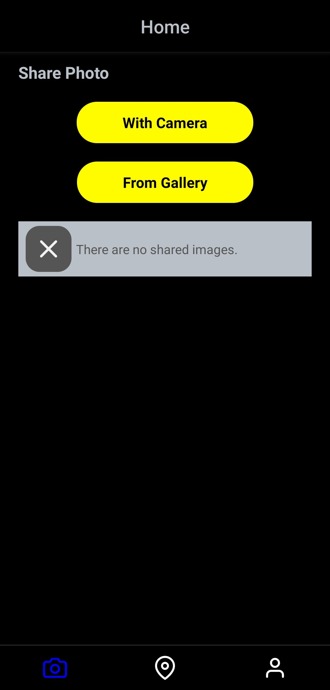</kbd>
<kbd>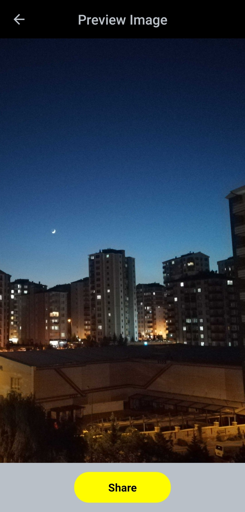</kbd>
<kbd>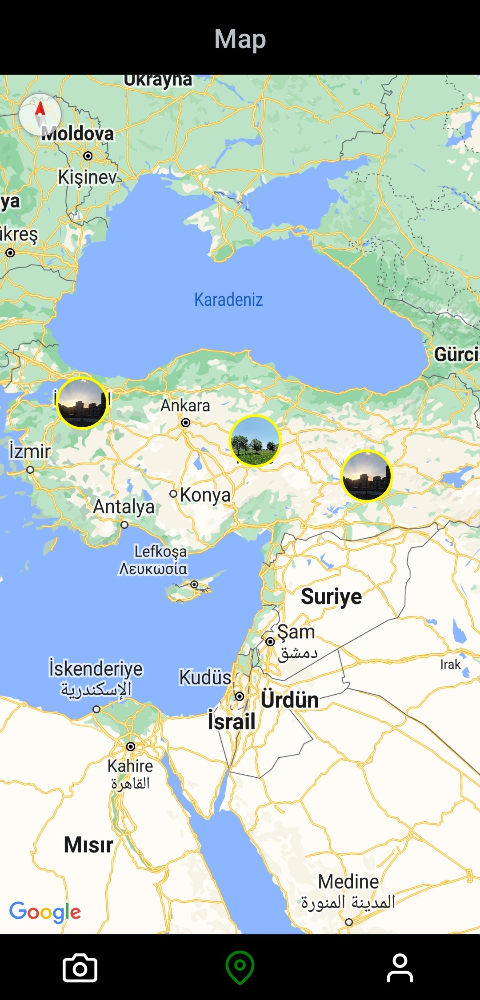</kbd>
</div>
<div>
<kbd>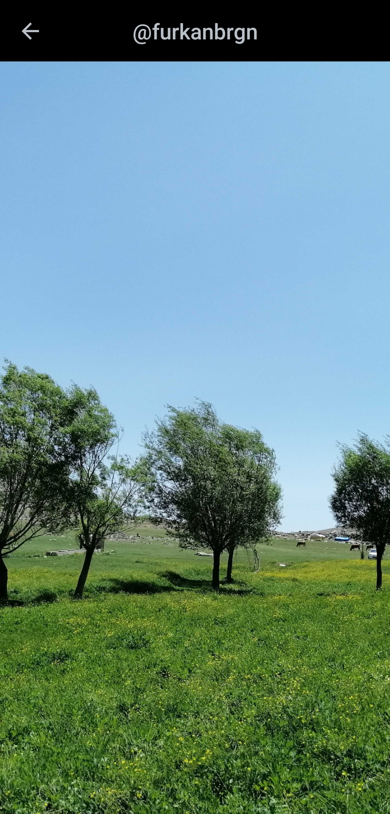</kbd>
<kbd>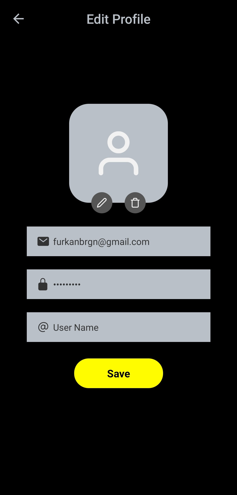</kbd>
<kbd>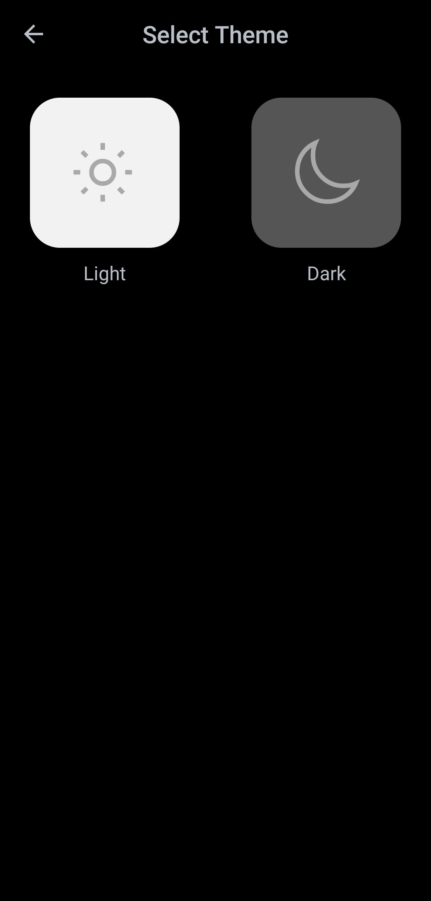</kbd>
</div>

## Installation
1.Clone Project
```
git clone https://github.com/patika-218-akbank-reactnative-bootcamp/assignment-6-furkanbagirgan.git
```
2.Install the Necessary Packages for Project
```
npm install
or
yarn install
```
3.Run Project To Emulator or Real Device
```
npx expo start & npx expo run:android | npx expo run:ios
or
yarn expo start & yarn expo run:android | yarn expo run:ios
```
